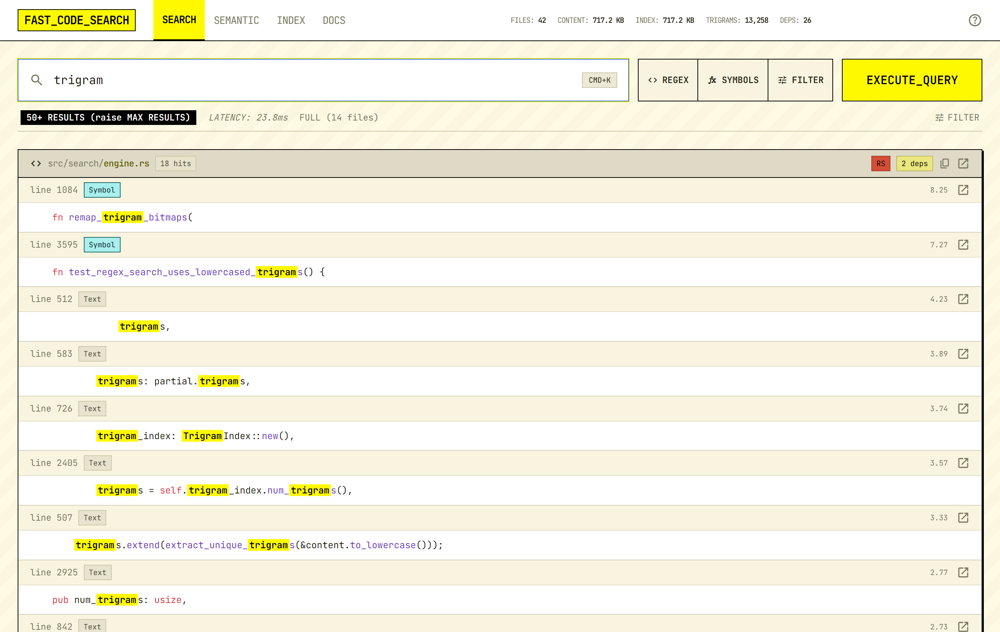
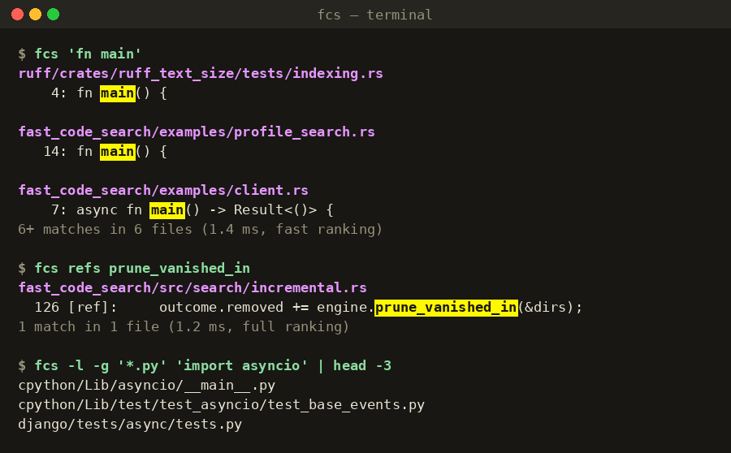

<div align="center">

# fast_code_search

**Code search that ranks like code.**

Definitions above usages. The files your codebase depends on above the ones it doesn't.
Served from an in-memory trigram index in milliseconds, with a CLI, a web UI, and REST and gRPC APIs.

[](https://github.com/jburrow/fast_code_search/actions/workflows/ci.yml)
[](https://github.com/jburrow/fast_code_search/actions/workflows/benchmark.yml)
[](https://github.com/jburrow/fast_code_search/releases/latest)
[](LICENSE)
[](https://jburrow.github.io/fast_code_search/docs/)

**[Documentation](https://jburrow.github.io/fast_code_search/docs/)** ·
[Install](https://jburrow.github.io/fast_code_search/docs/start/install.html) ·
[First search](https://jburrow.github.io/fast_code_search/docs/start/first-search.html) ·
[Guides](https://jburrow.github.io/fast_code_search/docs/guides/configuration.html) ·
[How it works](https://jburrow.github.io/fast_code_search/docs/how-it-works/indexing.html) ·
[Benchmarks](https://jburrow.github.io/fast_code_search/docs/benchmarks/methodology.html)



</div>

---

Most code search tools rank by text. `grep` and ripgrep return lines in file order;
an IDE's "find in files" does the same with a nicer list. fast_code_search indexes
your tree once, keeps the index in memory, and ranks every hit the way a reader of
the code would:

| Signal | Effect |
|--------|--------|
| The line **defines** the symbol (tree-sitter, 12 languages) | 3× |
| The file is **imported by** other files (resolved import graph) | `1 + 0.5·log10(dependents)` |
| The line holds the **whole phrase** you typed, or **every term** | a tier above all other lines |
| Exact case, match at the start of the line, file under `src/` or `lib/` | 2× / 1.5× / 1.5× |
| Test and example paths | demoted |

So `fn main` returns `fn main()` lines first, `Widget` returns the type's definition
before its two hundred uses, and a widely imported module outranks a scratch file
that happens to mention the same word. `refs NAME` flips it around: every call site
and type mention of an identifier, across languages. The weights live in one file,
[`src/search/ranking.rs`](src/search/ranking.rs).

## Install

**Release archive** (Linux, macOS, Windows): download from
[releases](https://github.com/jburrow/fast_code_search/releases/latest), unpack, and
put `fast_code_search_server` and `fcs` on your `PATH`. Each archive includes a
config template, the startup unit files and the guides.

**With cargo** (Rust 1.89+; the source build also needs `protoc`):

```bash
cargo binstall --git https://github.com/jburrow/fast_code_search fast_code_search   # downloads the release archive
cargo install --git https://github.com/jburrow/fast_code_search --bins              # builds from source
```

**Container** (indexes the mounted tree, serves the web UI on :8080):

```bash
docker run --rm -p 8080:8080 -v "$PWD:/src:ro" ghcr.io/jburrow/fast_code_search
```

Release archives are signed through Sigstore and carry a `.sha256`; the
[install guide](https://jburrow.github.io/fast_code_search/docs/start/install.html)
shows how to verify one.

## Quick start

```bash
fast_code_search_server --init ~/.config/fast_code_search/config.toml   # then add your paths
fast_code_search_server                                                  # builds the index, opens :8080
fcs 'fn main'                                                            # from another terminal
```



```bash
fcs -e 'fn\s+\w+\(' -g '*.rs' -C 2    # regex, Rust files only, two lines of context
fcs refs helper                       # references; `fcs symbols helper` for definitions
fcs -l TODO | xargs $EDITOR           # files only
vim -q <(fcs --format vimgrep TODO)   # quickfix list; exit codes follow grep (0 / 1 / 2)
```

The web UI is at http://127.0.0.1:8080, the JSON API under `/api/`
(`curl "localhost:8080/api/search?q=fn%20main"`), gRPC on `:50051`. To keep the
server running on a developer machine, start it at login:
[docs/RUN-AT-STARTUP.md](docs/RUN-AT-STARTUP.md) (systemd, launchd, Task Scheduler).

## What you get

- **Query syntax** shared by the CLI, UI and API: `"exact phrase"`, `-term`,
  `file:src/`, `lang:rust`, `case:yes`, `word:yes`; regex with literal
  pre-filtering through the trigram index; symbols-only and references modes.
- **Live index.** A file watcher applies edits, renames and deletes in place; a
  branch switch re-indexes a burst of files with one pass over the index.
- **Persistent index.** Atomic, checksummed save and mmap load; a restart of a
  60k-file index takes seconds and reconciles what changed while it was down.
- **Bounded by design.** Every search runs under a deadline and a match budget,
  page sizes and offsets are capped, regexes have size limits, and results are
  interleaved by file so one file cannot fill a page.
- **`fcs`** ([docs/CLI.md](docs/CLI.md)): grep-style output and exit codes, `--json`,
  and an offline fallback that searches the saved index when the server is down.
- **Semantic search** (optional, experimental, behind the `semantic` feature):
  natural-language queries over TF-IDF or embedding vectors on its own ports; see
  [docs/semantic/SEMANTIC_SEARCH_README.md](docs/semantic/SEMANTIC_SEARCH_README.md).

## Benchmarks

Three things are measured, on every push to `main`, by one
[workflow](https://github.com/jburrow/fast_code_search/actions/workflows/benchmark.yml)
on a GitHub-hosted runner:

- **Latency** over two pinned real repositories,
  [tokio 1.45.0](https://github.com/tokio-rs/tokio/tree/tokio-1.45.0) and
  [Django 5.2](https://github.com/django/django/tree/5.2), indexed from scratch
  each run. Every query is timed 30 times in-process after warm-up; the tables
  report the median (p50) and the 95th percentile (p95). Lower is better.
- **Ranking quality**: does the first result answer the query? Twenty labelled
  queries over the same repositories, scored as precision@1 and precision@5.
  Higher is better; the build fails below 0.90 / 0.95.
- **Against scan tools**: the same queries through ripgrep, ugrep and `fcs` on
  the same tree and machine, warm cache, median of seven runs.

Every run publishes its raw JSON with the machine specification, and the
[trend page](https://jburrow.github.io/fast_code_search/dev/bench/) charts each
measurement per commit with an explanation of what each chart means. The
[methodology](https://jburrow.github.io/fast_code_search/docs/benchmarks/methodology.html)
page says what is deliberately not claimed.

The numbers below are from
[run 34254363545](https://github.com/jburrow/fast_code_search/actions/runs/34254363545)
on commit `f46e7bf` (2026-09-08, GitHub-hosted `ubuntu-latest`, 4 vCPU):
6,237 files, 38.9 MB of text, 242k symbol references.

| Measure | Value |
|---------|-------|
| Full build (read, trigrams, symbols, imports, merge) | 4.3 s (1,460 files/s) |
| Resident memory after build | 118 MB |
| Index save / reconciling load | 0.20 s / 0.25 s (21.5 MB on disk) |
| Text search, common word, p50 / p95 | 0.95 ms / 1.03 ms |
| Text search, identifier, p50 | 1.5 ms |
| Regex with literal / case-insensitive / no literal, p50 | 1.4 ms / 0.7 ms / 1.7 ms |
| Symbol search, p50 | 3.7 ms |
| Reference search, p50 | 0.7 ms |
| Incremental update of one file, p50 / p95 | 10 ms / 14 ms |

The same run's Criterion suite over a synthetic corpus puts a common-word text
search at 0.39 ms and a no-match query at 0.45 µs. A nightly job indexes the
`rust-lang/rust` 1.89.0 tree and records throughput and memory in its job summary.

Speed is only half of it. The
[ranking-quality suite](https://jburrow.github.io/fast_code_search/docs/benchmarks/ranking-quality.html)
names the file and line a reader would want first for each query (`struct
Runtime` → the definition, not a doc comment; `Field` → the model field, not the
GDAL one) and currently scores precision@1 = 1.00, precision@5 = 1.00. The
[comparison](https://jburrow.github.io/fast_code_search/docs/benchmarks/comparison.html)
page puts ripgrep at 30–80 ms per query on these trees against about a
millisecond in the engine, and says plainly when a scan tool is the better
choice. Reproduce any of it locally:

```bash
cargo run --release --example corpus_bench -- path/to/repo [more paths]
cargo run --release --example ranking_quality -- bench-corpus/tokio bench-corpus/django
scripts/bench/compare.sh path/to/repo      # ripgrep / ugrep / fcs on the same queries
cargo bench
```

Why a server rather than a faster grep: a scan tool pays the read cost on every
query, which is unbeatable once and a poor fit for a query per keystroke. The index
pays it once. [docs/design/PRIOR_ART.md](docs/design/PRIOR_ART.md) compares the
architecture with ripgrep, Zoekt and GitHub code search.

## How it works

Indexing reads files in parallel, extracts trigrams into Roaring-bitmap posting
lists and symbols with tree-sitter, resolves imports into a dependency graph, and
merges into the engine in batches so searches stay live during a build. A query
intersects the posting lists of its trigrams to get candidates, scans them in
parallel under a match budget, scores each hit with the signals above, and pages
deterministically. Details: [docs/DEVELOPMENT.md](docs/DEVELOPMENT.md) and the
[How it works](https://jburrow.github.io/fast_code_search/docs/how-it-works/indexing.html) chapter of the documentation.

| Area | Source |
|------|--------|
| Trigram index, file store, persistence | `src/index/` |
| Query execution, ranking, regex analysis, watcher | `src/search/` |
| Symbol and reference extraction | `src/symbols/` |
| Import resolution | `src/dependencies/` |
| gRPC, REST + web UI, CLI | `src/server/`, `src/web/`, `src/cli/` |

Symbol-aware ranking covers Rust, Python, JavaScript, TypeScript, Go, C, C++, Java,
C#, Ruby, PHP and Bash; JSON, TOML, YAML, HTML, CSS and Markdown get structural
symbols; everything else is indexed and searchable without the ranking boosts.

## Documentation

The [documentation site](https://jburrow.github.io/fast_code_search/docs/) is built from this repository on every push. It
is organised the way questions arrive:

- **Start here** — [Install](https://jburrow.github.io/fast_code_search/docs/start/install.html) ·
  [First index, first search](https://jburrow.github.io/fast_code_search/docs/start/first-search.html) ·
  [Web UI](https://jburrow.github.io/fast_code_search/docs/start/web-ui.html) · [Editors](https://jburrow.github.io/fast_code_search/docs/start/editors.html) ·
  [Command-line client](https://jburrow.github.io/fast_code_search/docs/imported/cli.html) ·
  [Run at startup](https://jburrow.github.io/fast_code_search/docs/imported/run-at-startup.html)
- **Guides** — [Configuration cookbook](https://jburrow.github.io/fast_code_search/docs/guides/configuration.html) ·
  [Performance and memory](https://jburrow.github.io/fast_code_search/docs/guides/performance.html) ·
  [Troubleshooting](https://jburrow.github.io/fast_code_search/docs/guides/troubleshooting.html) ·
  [Upgrading](https://jburrow.github.io/fast_code_search/docs/guides/upgrading.html) · [Deployment](https://jburrow.github.io/fast_code_search/docs/imported/deployment.html)
- **Reference** — [API and configuration](https://jburrow.github.io/fast_code_search/docs/imported/api.html) ·
  [Query syntax](https://jburrow.github.io/fast_code_search/docs/reference/query-syntax.html) ·
  [`fcs` command line](https://jburrow.github.io/fast_code_search/docs/reference/cli-help.html) ·
  [Server command line](https://jburrow.github.io/fast_code_search/docs/reference/server-help.html) ·
  [Configuration template](https://jburrow.github.io/fast_code_search/docs/reference/config-template.html) ·
  [Index file format](https://jburrow.github.io/fast_code_search/docs/reference/index-format.html)
- **How it works** — [Indexing pipeline](https://jburrow.github.io/fast_code_search/docs/how-it-works/indexing.html) ·
  [Candidates and regex analysis](https://jburrow.github.io/fast_code_search/docs/how-it-works/candidates.html) ·
  [Ranking](https://jburrow.github.io/fast_code_search/docs/how-it-works/ranking.html) ·
  [Incremental updates](https://jburrow.github.io/fast_code_search/docs/how-it-works/incremental.html) ·
  [Persistence](https://jburrow.github.io/fast_code_search/docs/how-it-works/persistence.html) ·
  [Memory and limits](https://jburrow.github.io/fast_code_search/docs/how-it-works/memory.html)
- **Benchmarks** — [Methodology](https://jburrow.github.io/fast_code_search/docs/benchmarks/methodology.html) ·
  [Latest results](https://jburrow.github.io/fast_code_search/docs/benchmarks/latest.html) ·
  [Against ripgrep and ugrep](https://jburrow.github.io/fast_code_search/docs/benchmarks/comparison.html) ·
  [Ranking quality](https://jburrow.github.io/fast_code_search/docs/benchmarks/ranking-quality.html) ·
  [Trends per commit](https://jburrow.github.io/fast_code_search/dev/bench/)
- **Project** — [Changelog](CHANGELOG.md) · [Roadmap](https://jburrow.github.io/fast_code_search/docs/project/roadmap.html) ·
  [Contributing](CONTRIBUTING.md) · [Development](docs/DEVELOPMENT.md) ·
  [Security policy](SECURITY.md) · [Code of conduct](CODE_OF_CONDUCT.md) ·
  [Prior art](docs/design/PRIOR_ART.md) · [Glossary](docs/GLOSSARY.md)

The same pages live as Markdown under [`docs/`](docs/) and read fine on GitHub;
the site adds generated reference pages, search and the live benchmark data.

## Security

The server has no authentication and returns full file contents, so both
listeners bind to loopback by default. Put it behind an authenticating proxy
before exposing it; see [SECURITY.md](SECURITY.md).

## License

MIT — see [LICENSE](LICENSE).
