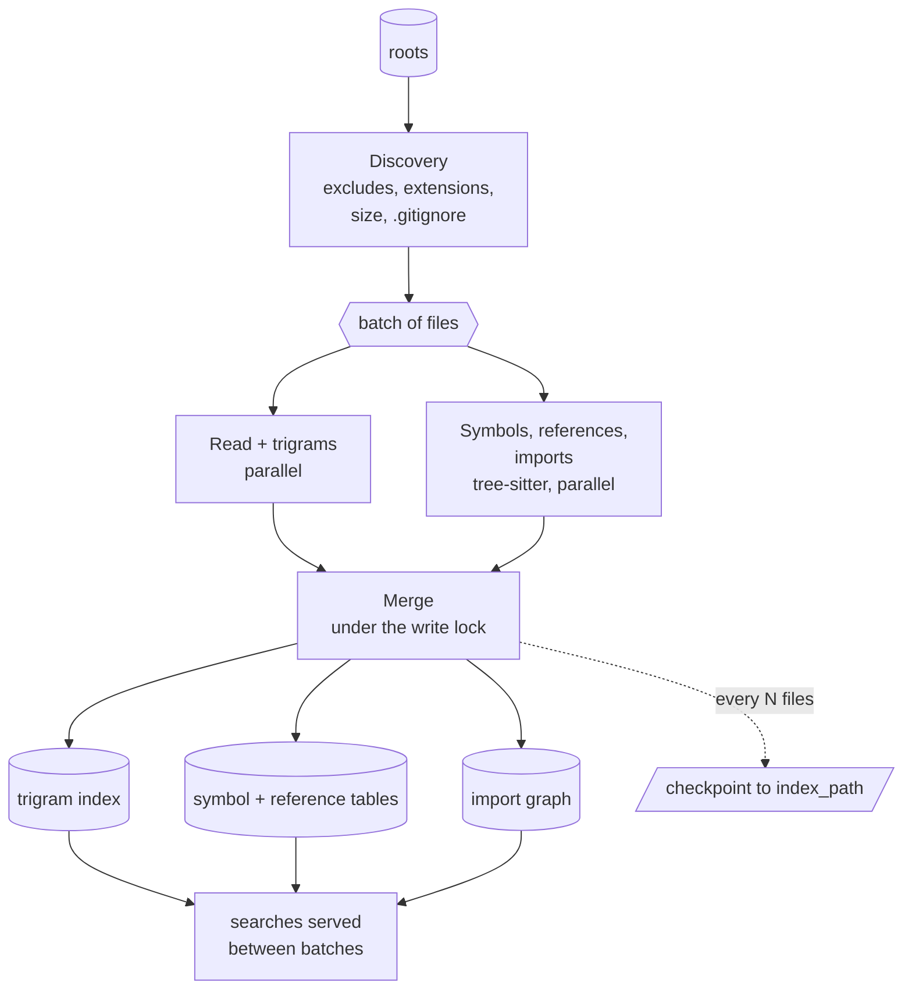

# Indexing pipeline

A build turns a set of directories into three structures held in memory:
a trigram index, per-file symbol and reference tables, and an import
graph. Searches are served throughout.

1. **Discovery.** Each root is walked with the exclude patterns, the
   include-extension list, the binary and size rules and `.gitignore`
   applied. Excluded directories are never entered. The same rule set
   (one `EligibilityProbe`) decides for watcher events and for
   reconciliation on load, so the three can never disagree.
2. **Read and trigrams, in parallel.** Every file is read into an owned
   buffer (never through a live memory map, so a file being rewritten
   cannot crash the process), transcoded if it is not UTF-8, and reduced
   to its set of lowercase trigrams. The mtime and size at read time are
   recorded for later staleness checks.
3. **Symbols, in parallel.** tree-sitter parses the file with the
   grammar's `tags.scm` query (plus supplements: Rust scoped and generic
   calls and type mentions, TypeScript call sites) under a timeout and a
   panic guard. Definitions become symbols; call sites and type mentions
   become references; import statements are collected.
4. **Merge, under the write lock.** Files are registered, postings
   inserted, symbols and references stored, imports resolved against the
   files known so far; unresolved imports are parked and retried when a
   file with a matching name appears. Batches are small so a search only
   ever waits for one merge.
5. **Checkpoint and save.** Every `checkpoint_interval_files` files and at
   the end, the index is written atomically to `index_path`
   ([Persistence](persistence.md)).

Per-file metadata for fast ranking (symbol density, dependents, location,
test-path penalty) is computed after the build and refreshed as files
change.

## Languages

Symbol-aware indexing covers Rust, Python, JavaScript, TypeScript, Go, C,
C++, Java, C#, Ruby, PHP and Bash; JSON, TOML, YAML, HTML, CSS and Markdown
get structural symbols (keys, headings). Every other text file is indexed
for full-text and regex search without symbols.
