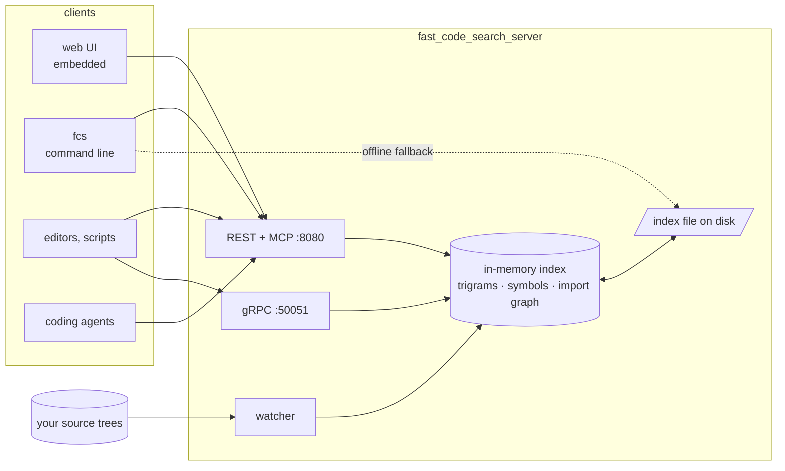

# fast_code_search

**Code search that ranks like code.** fast_code_search indexes your source
trees once, keeps a trigram index in memory, and ranks every hit the way a
reader of the code would: definitions above usages, files the rest of the
codebase imports above the ones nothing depends on, the phrase you typed
above lines that merely contain its words. Queries answer in milliseconds
over gigabytes of code, from a command-line client, a web UI, or REST and
gRPC APIs.

`fcs 'fn main'` returns `fn main()` lines first. `fcs symbols Widget` returns
the type's definition, not its two hundred uses. `fcs refs Widget` returns
those uses. See [Ranking](how-it-works/ranking.md) for why.

## Where to go

| You want to… | Read |
|---|---|
| install and run a first search | [Install](start/install.md), then [First index, first search](start/first-search.md) |
| use it from a terminal or an editor | [Command-line client](imported/cli.md), [Editors](start/editors.md) |
| give a coding agent the index | [Coding agents (MCP)](start/editors.md#coding-agents-mcp) |
| keep it running on your machine | [Run at startup](imported/run-at-startup.md) |
| index many repositories or a monorepo | [Configuration cookbook](guides/configuration.md) |
| know what a request or config key does | [API and configuration](imported/api.md), [Query syntax](reference/query-syntax.md) |
| know where results differ from grep or ripgrep | [Matching compared with grep and ripgrep](reference/matching.md) |
| understand the ranking or the index | [How it works](how-it-works/indexing.md) |
| check the numbers | [Benchmarks](benchmarks/methodology.md) |
| fix something | [Troubleshooting](guides/troubleshooting.md) |

## The parts

- **`fast_code_search_server`** builds and holds the index, watches the tree
  for changes, and serves the web UI on `127.0.0.1:8080` and gRPC on
  `127.0.0.1:50051`.
- **`fcs`** is the command-line client: grep-style output and exit codes,
  `--json` for tools, and an offline fallback that searches the saved index
  when the server is down.
- **The web UI** is embedded in the server: search-as-you-type, hover
  previews, references, regex help, a dependency explorer for the import
  graph, a diagnostics page.
- **REST and gRPC** expose the same queries to editors and scripts, and
  **MCP** at `/mcp` exposes them to coding agents.

Source, issues and releases: [github.com/jburrow/fast_code_search](https://github.com/jburrow/fast_code_search).
